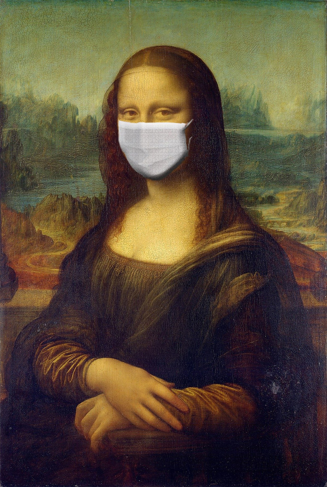

```{r setup, include = FALSE}
library(knitr)                              # paquete que trae funciones utiles para R Markdown
library(tidyverse)                          # paquete que trae varios paquetes comunes en el tidyverse
library(datos)                              # paquete que viene con datos populares traducidos al español :)
library(shiny)
# opciones predeterminadas
knitr::opts_chunk$set(echo = FALSE,         # FALSE: los bloques de código NO se muestran
                      dpi = 300,            # asegura gráficos de alta resolución
                      warning = FALSE,      # los mensajes de advertencia NO se muestran
                      error = FALSE)        # los mensajes de error NO se muestran


options(htmltools.dir.version = FALSE)
```

class: inverse, left, bottom
background-image: url("img/back1.jpg")
background-size: cover


# **`r rmarkdown::metadata$title`**
----

## **`r rmarkdown::metadata$subtitle`**

### `r rmarkdown::metadata$author`
### `r rmarkdown::metadata$date`

```{r xaringanExtra-share-again, echo=FALSE}
xaringanExtra::use_share_again()
```

---
name: hola
class: inverse, middle, center


# Universidad del Tolima

--

## Diplomado en gestión de datos
---


.pull-left[

<br><br><br><br><br>

```{r echo=FALSE, out.width = "110%" }
knitr::include_graphics("img/gif1.gif")
```
]

<br><br><br><br><br>


.pull-right[
# Orlando Joaqui-Barandica
### [www.joaquibarandica.com](https://www.joaquibarandica.com)
 *PhD. Student in Industrial Engineering* 
 
 *MSc. Applied Economics*
 
 *BSc. Statistics*
]

---
class: center, middle

# Motivación...  🥳    #DataViz 


---


name: menu
background-image: url("img/back2.jpg")
background-size: cover
class: left, middle, inverse

# Contenido

----


.pull-left[
### `r icon("table")` [Tables in R](#Tablas)

### `r icon("chart-pie")` [Basic Graphs](#Basic)

### `r icon("chart-bar")` [Good Graphs](#Good)

### `r icon("diagnoses")` [Interactive Graphs](#Interactive)

]

.pull-right[
### `r icon("tachometer-alt")` [Dashboard](#Dashboard)

### `r icon("link")` [WebPage](#Webpage)

### `r icon("book-open")` [Programa del curso](#Programa)

]

---


.left-column[
# Data Viz in R-Studio


]

.right-column[

### De lo simple a lo complejo 😵

.center[
```{r echo=FALSE, out.width = "65%" }
knitr::include_graphics("img/img3.png")
```
]

.right[
----
*No siempre lo complejo es lo mejor*
]


]

---

name: Tablas

class: inverse, center, middle
# `r icon("table")`
# Tables in R
----
.right[
.bottom[
####  [`r icon("bell")`](#menu)
]
]


---

# `r icon("table")` Tables


```{r}
Covid<-readRDS("Covid.RDS")

#iris %>% 
Covid %>% 
  head() %>%
  knitr::kable(format = 'html')
```

--

.pull-left[

`Datos de COVID-19`

Los datos de `COVID-19` presentados tienen fecha de corte del 17 de Julio de 2020. Son descargados desde la página web [Datos abiertos Colombia](https://www.datos.gov.co)

]

.pull-right[

### Tabla básica

> Esta tabla es estática puede servir para la presentación en informes tipo PDF. Es una tabla de corte sencillo desde su aspecto visual.

]


---


# `r icon("table")` Tables

```{r}
#iris %>%  
  Covid %>%
  arrange(Fecha) %>%
  head(15) %>%
  DT::datatable(list(pageLength = 5))
  
```


### Tabla dinámica

> Este tipo de tablas permiten una interacción con el usuario, en la cual puede ordenar datos, filtrar, paginar, etc.


---


### Este slide resume información de una Data de más de 4'000.000 de registros. 📚

*Tablas y Mapas trabajando juntos!!*

```{r echo=FALSE, warning=FALSE, message=FALSE }


covid_geo<- readRDS("covid_geo.RDS")

library(crosstalk)
library(leaflet)
library(dplyr)
library(reactable)

# A SpatialPointsDataFrame for the map.
# Set a group name to share data points with the table.
brew_sp <- SharedData$new(covid_geo, group = "Departamento")


# A regular data frame (without coordinates) for the table.
# Use the same group name as the map data.
brew_data <- as_tibble(covid_geo) %>%
  SharedData$new(group = "Departamento")

map <- leaflet(brew_sp,width = 1100, height=200) %>%
  addTiles() %>%
  addMarkers(~Longitud,~Latitud,popup = ~as.character(Casos), label = ~as.character(Casos))

tbl <- reactable(
  brew_data,
  selection = "multiple",
  onClick = "select",
  rowStyle = list(cursor = "pointer"),
  minRows = 5,
  defaultPageSize = 5
)

htmltools::browsable(
  htmltools::tagList(map, tbl)
)


```


---
name: Basic
class: inverse, center, middle
# `r icon("chart-pie")`
# Basic Graphs
----
.right[
.bottom[
####  [`r icon("bell")`](#menu)
]
]


---

# `r icon("chart-pie")`  Basic Graphs

.left-column[
Un gráfico básico aunque puede ser muy informativo de manera clara y concisa, la estética *(Ej: Color, Relleno (Fill), Labels, Size, Axes, ...)* 💅 hace que su lectura no sea agradable.


### Barplot
]

.right-column[
```{r  echo=FALSE, warning=FALSE, message=FALSE, fig.height = 3 }
# defining vector
y <- c(15, 32, 10, 44, 56)
x <- c("Julia","Python", "R","Tableau","Power BI")


# plotting vector
barplot(y, xlab = "Softwares", col = "white",
		ylab = "Conteo", names.arg = x, main = "Uso de software por parte de los estudiantes")

```

]

---


# `r icon("chart-pie")`  Basic Graphs

.left-column[
Un gráfico básico aunque puede ser muy informativo de manera clara y concisa, la estética *(Ej: Color, Relleno (Fill), Labels, Size, Axes, ...)* 💅 hace que su lectura no sea agradable.


### Barplot
]

.right-column[
```{r  echo=FALSE, warning=FALSE, message=FALSE, fig.height = 3 }
# defining vector
y <- c(15, 32, 10, 44, 56)
x <- c("Julia","Python", "R","Tableau","Power BI")


# plotting vector
barplot(y, xlab = "Softwares", col = "green",
		ylab = "Conteo", names.arg = x, main = "Uso de software por parte de los estudiantes")

```


.footnote[
### 👀 Ojo!
> No siempre la solución es el color..

]
]

---

background-image: url(img/monalisa1.jpg)
background-size: cover

class: inverse, center, middle

# Entonces... ¿Qué es la estética?


---

# Estética

.left-column[

## Dícese de .... `r icon("glasses")`


]


.right-column[

La estética (del griego αἰσθητική [aisthetikê], ‘sensación’, ‘percepción’, y este de[aísthesis], ‘sensación’, ‘sensibilidad’, e -ικά [-icá], ‘relativo a’) es la rama de la filosofía que estudia la esencia y la percepción de la belleza y el arte.


Algunos autores definen la estética de manera más amplia, como el estudio de las experiencias estéticas y los juicios estéticos en general, y no solo los relativos a la belleza. Cuando juzgamos algo como «bello», «feo», «sublime» o «elegante» (por dar algunos ejemplos), estamos haciendo juicios estéticos, que a su vez expresan experiencias estéticas. La estética es el dominio de la filosofía, estudiando el arte y cualidades como la belleza; asimismo es el estudio de estas experiencias y juicios que suceden día a día en las actividades que realizamos, produciendo sensaciones y emociones ya sean positivas o negativas en nuestra persona. La estética busca el por qué de algunas cuestiones, por ejemplo, por qué algún objeto, pintura o escultura no resulta atractivo para los espectadores; por lo tanto el arte lleva relación a la estética ya que busca generar sensaciones a través de una expresión............ 🥱🥱🥱🥱🥱🥱🥱🥱🥱🥱🥱


----
.right[
Tomado de [Wikipedia](https://es.wikipedia.org/wiki/Est%C3%A9tica)
]
]


---

class: center, middle

.pull-left[


]


.pull-right[



]

----

# Al final la "estética es relativa"


### Lo que para uno es *"bonito"* para otro no

---

name: Good
class: inverse, center, middle
# `r icon("chart-bar")`
# Good Graphs
----
.right[
.bottom[
####  [`r icon("bell")`](#menu)
]
]


---

# `r icon("chart-bar")` Good Graphs


.pull-left[


### ggplot2

> Es una de las librerías de la colección de tidyverse. `ggplot2 es un sistema para crear gráficos de forma declarativa, basado en The Grammar of Graphics . Usted proporciona los datos, le dice a ggplot2 cómo asignar variables a la estética, qué geometrías gráficas usar y se encarga de los detalles.`

.center[

]

]

.pull-right[


```{r echo=FALSE, message=FALSE, warning=FALSE}
library(ggplot2)

# Create data
data <- data.frame(
  name=c("A","B","C","D","E") ,  
  value=c(3,12,5,18,45)
  )

# Barplot
ggplot(data, aes(x=name, y=value)) + 
  geom_bar(stat = "identity")
```


]


---

# `r icon("chart-bar")` Good Graphs


```{r echo=FALSE,message=FALSE,warning=FALSE,out.width="100%",fig.height=3.5 }
library(ggplot2)
library(patchwork)
p1 <- ggplot(mtcars) + geom_point(aes(mpg, disp))
p2 <- ggplot(mtcars) + geom_boxplot(aes(gear, disp, group = gear))
p3 <- ggplot(mtcars) + geom_smooth(aes(disp, qsec)) 
p4 <- ggplot(mtcars) + geom_bar(aes(carb)) 
(p1 | p2 | p3) / 
      p4

```


---

# `r icon("chart-bar")` Good Graphs

.pull-left[

```{r echo=FALSE, message=FALSE, warning=FALSE}
# Libraries
library(tidyverse)
library(hrbrthemes)
library(viridis)

# create a dataset
data <- data.frame(
  name=c( rep("A",500), rep("B",500), rep("B",500), rep("C",20), rep('D', 100)  ),
  value=c( rnorm(500, 10, 5), rnorm(500, 13, 1), rnorm(500, 18, 1), rnorm(20, 25, 4), rnorm(100, 12, 1) )
)

# Plot
data %>%
  ggplot( aes(x=name, y=value, fill=name)) +
    geom_boxplot() +
    scale_fill_viridis(discrete = TRUE, alpha=0.6) +
    geom_jitter(color="black", size=0.4, alpha=0.9) +
    theme_ipsum() +
    theme(
      legend.position="none",
      plot.title = element_text(size=11)
    ) +
    ggtitle("A boxplot with jitter") +
    xlab("")
```

]

.pull-right[

```{r echo=FALSE, message=FALSE, warning=FALSE}
# library
library(tidyverse)
 
# Create dataset
data <- data.frame(
  individual=paste( "Mister ", seq(1,60), sep=""),
  group=c( rep('A', 10), rep('B', 30), rep('C', 14), rep('D', 6)) ,
  value=sample( seq(10,100), 60, replace=T)
)
 
# Set a number of 'empty bar' to add at the end of each group
empty_bar <- 4
to_add <- data.frame( matrix(NA, empty_bar*nlevels(data$group), ncol(data)) )
colnames(to_add) <- colnames(data)
to_add$group <- rep(levels(data$group), each=empty_bar)
data <- rbind(data, to_add)
data <- data %>% arrange(group)
data$id <- seq(1, nrow(data))
 
# Get the name and the y position of each label
label_data <- data
number_of_bar <- nrow(label_data)
angle <- 90 - 360 * (label_data$id-0.5) /number_of_bar     # I substract 0.5 because the letter must have the angle of the center of the bars. Not extreme right(1) or extreme left (0)
label_data$hjust <- ifelse( angle < -90, 1, 0)
label_data$angle <- ifelse(angle < -90, angle+180, angle)
 
# Make the plot
p <- ggplot(data, aes(x=as.factor(id), y=value, fill=group)) +       # Note that id is a factor. If x is numeric, there is some space between the first bar
  geom_bar(stat="identity", alpha=0.5) +
  ylim(-100,120) +
  theme_minimal() +
  theme(
    legend.position = "none",
    axis.text = element_blank(),
    axis.title = element_blank(),
    panel.grid = element_blank(),
    plot.margin = unit(rep(-1,4), "cm") 
  ) +
  coord_polar() + 
  geom_text(data=label_data, aes(x=id, y=value+10, label=individual, hjust=hjust), color="black", fontface="bold",alpha=0.6, size=2.5, angle= label_data$angle, inherit.aes = FALSE ) 
 
p
```

]


---

# `r icon("chart-bar")` Good Graphs

### Maps in R


.left-column[

```{r echo=FALSE, message=FALSE, warning=FALSE , out.width = "900%",fig.height=  10 }
library(maptools)
data(wrld_simpl)
afr=wrld_simpl[wrld_simpl$REGION==2,]
 
# We can visualize the region's boundaries with the plot function
plot(afr)
```


# `r icon("arrow-alt-circle-right")` `r icon("arrow-alt-circle-right")` `r icon("arrow-alt-circle-right")` 


]


.right-column[

```{r echo=FALSE, message=FALSE, warning=FALSE,  fig.height = 3 }


# Mapa africa

# Get the shape file of Africa
library(maptools)
data(wrld_simpl)
afr=wrld_simpl[wrld_simpl$REGION==2,]

# We can visualize the region's boundaries with the plot function
#plot(afr)

library(sf)

sfno <- st_as_sf(afr)
#st_crs(sfno)

sfproj <- st_transform(sfno, crs = 23038)
#st_crs(sfproj)

# We work with the cartogram library 
library(cartogram)

# construct a cartogram using the population in 2005
afr_cartogram <- cartogram_cont(sfproj, "POP2005", itermax=5)

# This is a new geospatial object, we can visualise it!
#plot(afr_cartogram)


ggplot() +
  geom_sf(data = afr_cartogram, aes(fill = POP2005))

```

]


---

# `r icon("comment-dots")` Text Mining

### Wordcloud

.left[
```{r echo=FALSE, message=FALSE, warning=FALSE, fig.height = 1, out.width="100%" }
# library
library(wordcloud2) 
 
# have a look to the example dataset
# head(demoFreq)

# Basic plot
demoFreq %>% 
  wordcloud2()

```
]


---
name: Interactive
class: inverse, center, middle
# `r icon("diagnoses")`
# Interactive Graphs
----
.right[
.bottom[
####  [`r icon("bell")`](#menu)
]
]


---

# `r icon("diagnoses")` Interactive Graphs


.pull-left[


### plotly

> La biblioteca de gráficos R de Plotly crea gráficos interactivos con calidad de publicación (También proporciona librerías para Python). `Las bibliotecas de gráficos de código abierto de Plotly son de uso gratuito, funcionan sin conexión y no requieren ningún registro de cuenta. Plotly también tiene ofertas comerciales, como Dash Enterprise y Chart Studio Enterprise.` 


.center[

]

]

.pull-right[


```{r echo=FALSE, message=FALSE, warning=FALSE }

library(plotly)
# volcano is a numeric matrix that ships with R
fig.3d <- plot_ly(z = ~volcano)
fig.3d <- fig.3d %>% add_surface()

htmltools::save_html(fig.3d, file="img/fig.3d.html")

```

.center[
<iframe src="img/fig.3d.html" allowtransparency="true" height="450" width="1100" scrolling="yes" style="border: none;" data-external="1"></iframe>
]


]


---

# `r icon("diagnoses")` Interactive Graphs

### Maps

```{r echo=FALSE, message=FALSE, warning=FALSE }
library(plotly)
df <- read.csv("https://raw.githubusercontent.com/plotly/datasets/master/2011_us_ag_exports.csv")
df$hover <- with(df, paste(state, '<br>', "Beef", beef, "Dairy", dairy, "<br>",
                           "Fruits", total.fruits, "Veggies", total.veggies,
                           "<br>", "Wheat", wheat, "Corn", corn))
# give state boundaries a white border
l <- list(color = toRGB("white"), width = 2)
# specify some map projection/options
g <- list(
  scope = 'usa',
  projection = list(type = 'albers usa'),
  showlakes = TRUE,
  lakecolor = toRGB('white')
)

fig.map <- plot_geo(df, locationmode = 'USA-states')
fig.map <- fig.map %>% add_trace(
    z = ~total.exports, text = ~hover, locations = ~code,
    color = ~total.exports, colors = 'Purples'
  )
fig.map <- fig.map %>% colorbar(title = "Millions USD")
fig.map <- fig.map %>% layout(
    title = '2011 US Agriculture Exports by State<br>(Hover for breakdown)',
    geo = g
  )

htmltools::save_html(fig.map, file="img/fig.map.html")

```

.center[
<iframe src="img/fig.map.html" allowtransparency="true" height="450" width="1100" scrolling="yes" style="border: none;" data-external="1"></iframe>
]


---


# `r icon("diagnoses")` Interactive Graphs

### Maps (leaflet)

```{r, echo=FALSE}
library(leaflet)
df <- data.frame(
  name = c("Ibagué", "Cali"),
  lat = c(4.433, 3.421),
  long = c(-75.217,-76.52),
  stringsAsFactors = FALSE)

l <- leaflet(df,width = 1100, height=400) %>% 
  addTiles() %>%
  addCircleMarkers(~long, ~lat, 
				   popup = ~name,
				   stroke = FALSE,
				   fillOpacity = 1)

l

```


---

# `r icon("diagnoses")` Interactive Graphs

### Descriptive Graph (Bar)

```{r echo=FALSE, message=FALSE, warning=FALSE }
library(plotly)

Animals <- c("giraffes", "orangutans", "monkeys")
SF_Zoo <- c(20, 14, 23)
LA_Zoo <- c(12, 18, 29)
data <- data.frame(Animals, SF_Zoo, LA_Zoo)

fig.bar <- plot_ly(data, x = ~Animals, y = ~SF_Zoo, type = 'bar', name = 'SF Zoo')
fig.bar <- fig.bar %>% add_trace(y = ~LA_Zoo, name = 'LA Zoo')
fig.bar <- fig.bar %>% layout(yaxis = list(title = 'Count'), barmode = 'group')

htmltools::save_html(fig.bar, file="img/fig.bar.html")
```


.center[
<iframe src="img/fig.bar.html" allowtransparency="true" height="450" width="1100" scrolling="yes" style="border: none;" data-external="1"></iframe>
]


---

# `r icon("diagnoses")` Interactive Graphs

### Descriptive Graph (Pie)

```{r echo=FALSE, message=FALSE, warning=FALSE }
# Load ggplot2
library(plotly)

USPersonalExpenditure <- data.frame("Categorie"=rownames(USPersonalExpenditure), USPersonalExpenditure)
data <- USPersonalExpenditure[,c('Categorie', 'X1960')]

fig_pie <- plot_ly(data, labels = ~Categorie, values = ~X1960, type = 'pie')
fig_pie <- fig_pie %>% layout(title = 'United States Personal Expenditures by Categories in 1960',
         xaxis = list(showgrid = FALSE, zeroline = FALSE, showticklabels = FALSE),
         yaxis = list(showgrid = FALSE, zeroline = FALSE, showticklabels = FALSE))


htmltools::save_html(fig_pie, file="img/fig_pie.html")

```


.center[
<iframe src="img/fig_pie.html" allowtransparency="true" height="450" width="1100" scrolling="yes" seamless="seamless" frameBorder="0" data-external="1"> </iframe>
]


---


# `r icon("diagnoses")` Interactive Graphs

### Descriptive Graph (Line)

```{r echo=FALSE, message=FALSE, warning=FALSE }
library(plotly)
today <- Sys.Date()
tm <- seq(0, 600, by = 10)
x <- today - tm
y <- rnorm(length(x))
fig.series <- plot_ly(x = ~x, y = ~y, mode = 'lines', text = paste(tm, "days from today"))

htmltools::save_html(fig.series, file="img/fig.series.html")
```

.center[
<iframe src="img/fig.series.html" allowtransparency="true" height="450" width="1100" scrolling="yes" seamless="seamless" frameBorder="0" data-external="1"> </iframe>
]


---


# `r icon("diagnoses")` Interactive Graphs

### GGPLOT2 ➡️ plotly::ggplotly()


.pull-left[

```{r echo=FALSE, message=FALSE, warning=FALSE , fig.height = 5  }
# Libraries
library(ggplot2)
library(dplyr)
library(plotly)
library(viridis)
library(hrbrthemes)

# The dataset is provided in the gapminder library
library(gapminder)
data <- gapminder %>% filter(year=="2007") %>% dplyr::select(-year)

# Interactive version
bubble <- data %>%
  mutate(gdpPercap=round(gdpPercap,0)) %>%
  mutate(pop=round(pop/1000000,2)) %>%
  mutate(lifeExp=round(lifeExp,1)) %>%
  
  # Reorder countries to having big bubbles on top
  arrange(desc(pop)) %>%
  mutate(country = factor(country, country)) %>%
  
  # prepare text for tooltip
  mutate(text = paste("Country: ", country, "\nPopulation (M): ", pop, "\nLife Expectancy: ", lifeExp, "\nGdp per capita: ", gdpPercap, sep="")) %>%
  
  # Classic ggplot
  ggplot( aes(x=gdpPercap, y=lifeExp, size = pop, color = continent, text=text)) +
    geom_point(alpha=0.7) +
    scale_size(range = c(1.4, 19), name="Population (M)") +
    scale_color_viridis(discrete=TRUE, guide=FALSE) +
    theme_ipsum() +
    theme(legend.position="none")

bubble

# turn ggplot interactive with plotly
#pp <- ggplotly(p, tooltip="text")
#pp

# save the widget
# library(htmlwidgets)
# saveWidget(pp, file=paste0( getwd(), "/HtmlWidget/ggplotlyBubblechart.html"))
```


]


.pull-right[


```{r echo=FALSE, message=FALSE, warning=FALSE }
library(ggplot2)
library(dplyr)
library(plotly)
library(viridis)
library(hrbrthemes)

# The dataset is provided in the gapminder library
library(gapminder)
data <- gapminder %>% filter(year=="2007") %>% dplyr::select(-year)

# Interactive version
bubble <- data %>%
  mutate(gdpPercap=round(gdpPercap,0)) %>%
  mutate(pop=round(pop/1000000,2)) %>%
  mutate(lifeExp=round(lifeExp,1)) %>%
  
  # Reorder countries to having big bubbles on top
  arrange(desc(pop)) %>%
  mutate(country = factor(country, country)) %>%
  
  # prepare text for tooltip
  mutate(text = paste("Country: ", country, "\nPopulation (M): ", pop, "\nLife Expectancy: ", lifeExp, "\nGdp per capita: ", gdpPercap, sep="")) %>%
  
  # Classic ggplot
  ggplot( aes(x=gdpPercap, y=lifeExp, size = pop, color = continent, text=text)) +
    geom_point(alpha=0.7) +
    scale_size(range = c(1.4, 19), name="Population (M)") +
    scale_color_viridis(discrete=TRUE, guide=FALSE) +
    theme_ipsum() +
    theme(legend.position="none")

fig.bubble <- ggplotly(bubble, tooltip="text")

htmltools::save_html(fig.bubble, file="img/fig.bubble.html")
```

.center[
<iframe src="img/fig.bubble.html" allowtransparency="true" height="450" width="1100" scrolling="yes" seamless="seamless" frameBorder="0" data-external="1"> </iframe>
]


]


---

# `r icon("diagnoses")` Interactive Graphs

.left-column[
### Animated

*gganimate()*

Con las animaciones podemos generar impacto a nuestros graphs, mostrar evolución y mucho más.


]

.right-column[

```{r echo=FALSE, message=FALSE, warning=FALSE, fig.height= 4.5 }
library(ggplot2)
library(dplyr)

library(gapminder)
datos = gapminder


grafico <- datos %>%
  ggplot() + 
    geom_point(aes(x = gdpPercap, y = lifeExp, col = continent, size = pop), alpha = 0.8) + theme_minimal() + 
    theme(legend.position = "bottom") + guides(size = "none") + 
    labs(x = "PIB per Capita" ,y = "Esperanza de Vida",  col = "") 


library(gganimate)

grafico +
  transition_time(year)+
  labs(title = "Año: {frame_time}")


```

]

---

# `r icon("diagnoses")` Interactive Graphs

.left-column[
### Animated

*gganimate()*

Con las animaciones podemos generar impacto a nuestros graphs, mostrar evolución y mucho más.


]

.right-column[


```{r echo=FALSE, message=FALSE, warning=FALSE, fig.height= 5 }

datos2 <- datos %>%
  group_by(year) %>%
  arrange(year, desc(gdpPercap)) %>%
  mutate(ranking = row_number()) %>%
  filter(ranking <=15)


animacion <- datos2 %>%
  ggplot() +
  geom_col(aes(ranking, gdpPercap, fill = country)) +
  geom_text(aes(ranking, gdpPercap, label = gdpPercap), hjust=-0.1) +
  geom_text(aes(ranking, y=0 , label = country), hjust=1.1) + 
  geom_text(aes(x=15, y=max(gdpPercap) , label = as.factor(year)), vjust = 0.2, alpha = 0.5,  col = "gray", size = 20) +
  coord_flip(clip = "off", expand = FALSE) + scale_x_reverse() +
  theme_minimal() + theme(
    panel.grid = element_blank(), 
    legend.position = "none",
    axis.ticks.y = element_blank(),
    axis.title.y = element_blank(),
    axis.text.y = element_blank(),
    plot.margin = margin(1, 4, 1, 3, "cm")
  ) +
  transition_states(year, state_length = 0, transition_length = 2) +
  enter_fade() +
  exit_fade() + 
  ease_aes('quadratic-in-out') 

animate(animacion, width = 700, height = 432, fps = 25, duration = 15, rewind = FALSE)


```


]


---
name: Dashboard
class: inverse, center, middle
# `r icon("tachometer-alt")`
# Dashboard
----
.right[
.bottom[
####  [`r icon("bell")`](#menu)
]
]


---

#  `r icon("tachometer-alt")` Dashboard


.left-column[

## Shiny

.center[

]


*Shiny es un paquete R que facilita la creación de aplicaciones web interactivas (aplicaciones) directamente desde R.*

]


.right-column[

### Algunos ejemplos de aplicaciones en Shiny pueden ser:


* [Didactic modeling process: Linear regression for a safety issue in rural areas of Antioquia - Colombia](https://danielrivera1.shinyapps.io/Regression2/?_ga=2.187552808.1012673826.1626746491-448761589.1527204352)


* [A virtual lab for teaching physiology](https://dgranjon.shinyapps.io/virtual_patient_v2/_w_6c2f29f9/)


* [New Zealand Trade Intelligence Dashboard](https://gallery.shinyapps.io/nz-trade-dash/?_ga=2.192787626.1012673826.1626746491-448761589.1527204352)

* [Nutrition Calculator - calculate nutrition for recipes](https://yihanw.shinyapps.io/Recipe_Nutrition/?_ga=2.219059353.1012673826.1626746491-448761589.1527204352)

* [Genome browser](https://gallery.shinyapps.io/genome_browser/?_ga=2.193901613.1012673826.1626746491-448761589.1527204352)

* [The ten most similar players - Pro Evolution Soccer 2019](https://thiago-valentim.shinyapps.io/project/?_ga=2.28097724.1012673826.1626746491-448761589.1527204352)


]


---


#  `r icon("tachometer-alt")` Dashboard


.left-column[

## FlexDashboard

.center[

]


*El objetivo es facilitar la creación de paneles interactivos para R, utilizando R Markdown. Diseños basados en filas y columnas flexibles y fáciles de especificar.*

]


.right-column[

### Algunos ejemplos de aplicaciones en FlexDashboard pueden ser:


* [ggplotly: ggplot2 geoms](https://beta.rstudioconnect.com/jjallaire/htmlwidgets-ggplotly-geoms/htmlwidgets-ggplotly-geoms.html)


* [Gene Expression Biclustering](https://jjallaire.shinyapps.io/shiny-biclust/)


* [Sales Report with Highcharter](https://beta.rstudioconnect.com/jjallaire/htmlwidgets-highcharter/htmlwidgets-highcharter.html)

* [HTML Widgets Showcase](https://beta.rstudioconnect.com/jjallaire/htmlwidgets-showcase-storyboard/htmlwidgets-showcase-storyboard.html)

* [Waste Lands - America’s Forgotten Nuclear Legacy](https://beta.rstudioconnect.com/jjallaire/htmlwidgets-waste-sites/htmlwidgets-waste-sites.html)

* [Value at Risk](https://juniorjb5.shinyapps.io/Value_at_Risk/)


]


---
name: Webpage
class: inverse, center, middle
# `r icon("link")`
# WebPage
----
.right[
.bottom[
####  [`r icon("bell")`](#menu)
]
]


---


#  `r icon("link")` WebPage


.pull-left[

### 📕 [Blogdown](https://bookdown.org/yihui/blogdown/)

### 🎨 [Hugo Themes](https://themes.gohugo.io/)

### ⚙️ [Netlify](https://www.netlify.com/blog/2016/09/29/a-step-by-step-guide-deploying-on-netlify/)

### 💼 [Github](https://github.com/)

### 🎮 [Demo](https://academic-demo.netlify.app/)

]

.pull-right[


.center[
`How do you want the world to see you?`

🌍

]

]


---

class: center, middle

# Listo... ¿Motivados? 😎
----

--

## ¿Opiniones?... 🗣 ¿Expectativas? 💬


---


name: Programa
class: inverse

# `r icon("book-open")` Programa del curso

----

Saber hacer **ciencia de datos** es también saber **comunicar**. La comunicación eficaz es la piedra angular de la ciencia de datos impactante. Ya sea enseñando habilidades relacionadas con datos o informando los últimos resultados obtenidos en nuestros procesos estadísticos.

.pull-left[


Nuestro trabajo con datos computacionales requiere que nuestras presentaciones e informes sean tanto reproducibles cuando necesitemos recrear el trabajo de hoy en el futuro, como también adaptables cuando los datos del mañana cambien los resultados de hoy.


Este curso abarcará un mix de estilos para **#️⃣DataViz.** Aprenderemos la estructura necesaria de la data para la adecuada visualización de la información. Trabajaremos con paquetes como ggplot2, plotly, highchart, entre otros. Crearemos tableros dinámicos o dashboards.


]<!--end of left-column-->

.pull-right[


.left[


### 1. Estructura y Manipulación de la Data

### 2. Visualización estática *ggplot2*

### 3. Visualización dinámica

### 4. Dashboard

] <!--end of right-column-->

]

---

class: center, middle

.pull-left[

.center[
<br><br>

# Gracias!!!

<br><br><br><br><br>


### ¿Preguntas?
]


]


.pull-right[


### [www.joaquibarandica.com](https://www.joaquibarandica.com)
`r icon("twitter")` jotajb5

`r icon("github")` juniorjb5

`r icon("envelope")` orlando.joaqui@correounivalle.edu.co

]


<br><br><br>

----

*Las imágenes utilizadas para ambientar la presentación son de [pixabay](https://pixabay.com/).*


