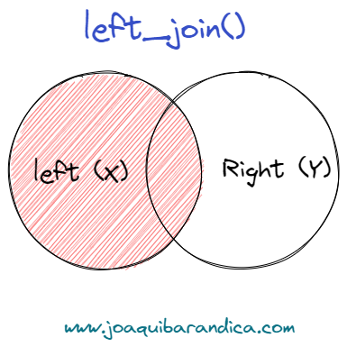

```{r setup, include = FALSE}
library(knitr)                              # paquete que trae funciones utiles para R Markdown
library(tidyverse)                          # paquete que trae varios paquetes comunes en el tidyverse
library(datos)                              # paquete que viene con datos populares traducidos al español :)
library(shiny)
library(icons)
# opciones predeterminadas
knitr::opts_chunk$set(echo = FALSE,         # FALSE: los bloques de código NO se muestran
                      dpi = 300,            # asegura gráficos de alta resolución
                      warning = FALSE,      # los mensajes de advertencia NO se muestran
                      error = FALSE)        # los mensajes de error NO se muestran


options(htmltools.dir.version = FALSE)
```

class: inverse, left, bottom
background-image: url("img/back1.jpg")
background-size: cover


# **`r rmarkdown::metadata$title`**
----

## **`r rmarkdown::metadata$subtitle`**

### `r rmarkdown::metadata$author`
### `r rmarkdown::metadata$date`

```{r xaringanExtra-share-again, echo=FALSE}
xaringanExtra::use_share_again()
```

---
name: hola
class: inverse, middle, center


# Universidad del Tolima

--

## Diplomado en gestión de datos
---


.pull-left[

<br><br><br><br><br>

```{r echo=FALSE, out.width = "110%" }
knitr::include_graphics("img/gif1.gif")
```
]

<br><br><br><br><br>


.pull-right[
# Orlando Joaqui-Barandica
### [www.joaquibarandica.com](https://www.joaquibarandica.com)
 *PhD. Student in Industrial Engineering* 
 
 *MSc. Applied Economics*
 
 *BSc. Statistics*
]

---

name: menu
background-image: url("img/back2.jpg")
background-size: cover
class: left, middle, inverse

# Contenido

----


.pull-left[
### `r icon("upload")` [Importing DATA](#Data)

### `r icon("broom")` [Cleaning DATA](#Clean)

]


.pull-right[
### `r icon("table")` [Tablas](#Tablas)

### `r icon("dice-d6")` [Introducción a ggplot2](#ggplot2)

]

---

name: Data
class: inverse, center, middle

# `r icon("upload")`
# Importing DATA
----

.right[
.bottom[
####  [`r icon("bell")`](#menu)
]
]

---


# `r icon("upload")` Importar Data


Antes de que pueda visualizar sus datos, debe ingresarlos en R. Esto implica importar los datos de una fuente externa y manejarlo en un formato útil.


.pull-left[

R puede importar datos de casi cualquier fuente, incluidos archivos de texto, hojas de cálculo de Excel, paquetes estadísticos y sistemas de administración de bases de datos. Ilustraremos estas técnicas utilizando el conjunto de datos `Salaries`, que contiene los salarios académicos de 9 meses de profesores universitarios en una sola institución en 2008-2009.


### Archivos de texto

* El paquete `readr` proporciona funciones para importar archivos de texto delimitados en marcos de datos R.

* Recordar también la función de base `read.csv()`

]


.pull-right[


```{r eval=FALSE, echo=TRUE, message=FALSE, warning=FALSE , fig.height = 4}
library(readr)

# import data from a comma delimited file
Salaries <- read_csv("salaries.csv")

# import data from a tab delimited file
Salaries <- read_tsv("salaries.txt")
```


Estas funciones asumen que la primera línea de datos contiene los nombres de las variables, los valores están separados por comas o tabulaciones, respectivamente, y que los datos faltantes están representados por espacios en blanco.


]


---


# `r icon("upload")` Importar Data


### Hojas de cálculo de Excel

.pull-left[

El paquete `readxl` puede importar datos de libros de Excel. Se admiten los formatos xls y xlsx.

----

```{r eval=FALSE, echo=TRUE, message=FALSE, warning=FALSE , fig.height = 4}
library(readxl)

# import data from an Excel workbook
Salaries <- read_excel("salaries.xlsx", sheet=1)
```

----

Dado que los libros de trabajo pueden tener más de una hoja de trabajo, puede especificar la que desee con la opción `sheet`. El valor predeterminado es `sheet=1`.

<br>

> También se puede utilizar la función `read_xlsx()`
]


.pull-right[

```{r echo=FALSE, message=FALSE, warning=FALSE , fig.height = 6 }
data(Salaries, package="carData")

Salaries %>% 
  head()

```

]


---


# `r icon("upload")` Importar Data


### Desde algún software


.left-column[

El paquete `haven` proporciona funciones para importar datos de una variedad de paquetes estadísticos.


.center[

]


]


.right-column[

----

```{r eval=FALSE, echo=TRUE, message=FALSE, warning=FALSE , fig.height = 4}
library(haven)

# import data from Stata
Salaries <- read_dta("salaries.dta")

# import data from SPSS
Salaries <- read_sav("salaries.sav")

# import data from SAS
Salaries <- read_sas("salaries.sas7bdat")
```

----

]


---


# `r icon("upload")` Importar Data


### Desde algún software


.pull-left[

La importación de datos de una base de datos requiere pasos adicionales. Dependiendo de la base de datos que contiene los datos, los siguientes paquetes pueden ayudar: 


* `RODBC` 
* `RMySQL` 
* `ROracle` 
* `RPostgreSQL` 
* `RSQLite`
* `RMongo` 


En las versiones más recientes de **RStudio**, puede usar el panel Conexiones para acceder rápidamente a los datos almacenados en los sistemas de administración de bases de datos.

]


.pull-right[

----


----

]


---

name: Clean
class: inverse, center, middle

# `r icon("broom")`
# Cleaning DATA
----

.right[
.bottom[
####  [`r icon("bell")`](#menu)
]
]

---

# `r icon("broom")` Cleaning DATA

Los procesos de limpieza de los datos pueden ser la parte más lenta de cualquier análisis de datos. Los pasos más importantes se consideran a continuación.

> Si bien existen muchos enfoques, los que usan los paquetes `dplyr` y `tidyr` son algunos de los más rápidos y fáciles de aprender.


.pull-left[

.center[


Los ejemplos de esta sección utilizarán el conjunto de datos de `starwars` del paquete `dplyr`. El conjunto de datos proporciona descripciones de 87 caracteres del universo de Starwars en 13 variables.
]
]

.pull-right[


|**Package** |	**Function** |	**Use** |
|--------| -------- |--------
|dplyr |	select |	select variables/columns|
|dplyr |	filter |	select observations/rows |
|dplyr |	mutate |	transform or recode variables|
|dplyr |	summarize |	summarize data|
|dplyr |	group_by |	identify subgroups for further processing|
|tidyr |	gather |	convert wide format dataset to long format|
|tidyr |	spread |	convert long format dataset to wide format|


]

---

# `r icon("broom")` Starwars


```{r eval =TRUE, echo=FALSE, message=FALSE, warning=FALSE , fig.height = 6 }

library(dplyr)

head(starwars,25)

```


---


# `r icon("broom")` Seleccionar variables

La función `select` le permite limitar su conjunto de datos a variables específicas (columnas).


----

* Guardamos las variables: `name`, `height` y `gender`

```{r eval=FALSE, echo=TRUE, message=FALSE, warning=FALSE , fig.height = 4}
newdata <- select(starwars, name, height, gender)
```

----


* Guardamos las variables: `name`, y todas las variables entre `mass` y `species`

```{r eval=FALSE, echo=TRUE, message=FALSE, warning=FALSE , fig.height = 4}
newdata <- select(starwars, name, mass:species)
```


----


* Guardamos todas las variables, excepto `birth_year` y `gender`

```{r eval=FALSE, echo=TRUE, message=FALSE, warning=FALSE , fig.height = 4}
newdata <- select(starwars, -birth_year, -gender)
```

----


---


# `r icon("broom")` Filtrar observaciones

La función `filter` le permite limitar su conjunto de datos a observaciones (filas) que cumplen un criterio específico. Se pueden combinar varios criterios con los símbolos `&` (Y) y `|` (O).


----

* Seleccionamos el género: `female`

```{r eval=FALSE, echo=TRUE, message=FALSE, warning=FALSE , fig.height = 4}
newdata <- filter(starwars, sex == "female")
```

----


* Seleccionar mujeres que son de Alderaan

```{r eval=FALSE, echo=TRUE, message=FALSE, warning=FALSE , fig.height = 4}
newdata <- filter(starwars, sex == "female" & homeworld == "Alderaan")
```


----

.pull-left[

1. Seleccionar individuos que sean de Alderaan, Coruscant o Endor ➡️ ➡️ ➡️

2. Lo anterior se puede escribir de manera más sucinta como ➡️ ➡️ ➡️
]


.pull-left[
```{r eval=FALSE, echo=TRUE, message=FALSE, warning=FALSE , fig.height = 4}
newdata <- filter(starwars, 
                  homeworld == "Alderaan" | 
                  homeworld == "Coruscant" | 
                  homeworld == "Endor")


newdata <- filter(starwars, 
                  homeworld %in% c("Alderaan", "Coruscant", "Endor"))

```

]


---


# `r icon("broom")` Crear/Recodificar variables

La función `mutate` le permite crear nuevas variables o transformar las existentes.


* Convertir la altura en centímetros a pulgadas y la masa en kilogramos a libras.

```{r eval=FALSE, echo=TRUE, message=FALSE, warning=FALSE , fig.height = 4}
newdata <- mutate(starwars, 
                  height = height * 0.394,
                  mass   = mass   * 2.205)
```

----


La función `ifelse` (parte de la base R) se puede utilizar para recodificar datos. El formato es `ifelse(test, return if TRUE, return if FALSE)`


.left-column[
.center[
**Qué hacen los códigos siguientes? 🤔**
]
]

.right-column[
```{r eval=FALSE, echo=TRUE, message=FALSE, warning=FALSE , fig.height = 4}
newdata <- mutate(starwars, 
                  heightcat = ifelse(height > 180, 
                                     "tall", "short"))
newdata <- mutate(starwars, 
                  eye_color = ifelse(eye_color %in% c("black", "blue", "brown"),
                                     eye_color,"other"))
newdata <- mutate(starwars, 
                  height = ifelse(height < 75 | height > 200,
                                     NA, height))
```
]


---


# `r icon("broom")` Crear/Recodificar variables

En el análisis de datos, puede haber muchos casos en los que tenga que lidiar con valores perdidos, valores negativos o valores no precisos que están presentes en el conjunto de datos. Estos valores también pueden afectar el resultado del análisis.


La función `replace` le permite reemplazar los valores falsos con valores apropiados.


```{r eval=FALSE, echo=TRUE, message=FALSE, warning=FALSE , fig.height = 4}
replace(x, list, values)
```


* `x` vector que contiene los valores
* `list` indica la posición del vector a reemplazar
* `values` los valores de reemplazo


----


```{r eval=TRUE, echo=TRUE, message=FALSE, warning=FALSE , fig.height = 4}
df<- c('apple', 'orange','grape','banana')
df
```


```{r eval=TRUE, echo=TRUE, message=FALSE, warning=FALSE , fig.height = 4}
dy<-replace(df, 2,'blueberry')
dy
```


---


# `r icon("broom")` Summarize

La función `summarize` se puede utilizar para reducir varios valores a un solo valor (como una media). A menudo se utiliza junto con la función `by_group` para calcular estadísticas por grupo. En el siguiente código, la opción `na.rm=TRUE` se usa para eliminar los valores faltantes antes de calcular las medias.

<br>

.pull-left[

```{r eval=FALSE, echo=TRUE, message=FALSE, warning=FALSE , fig.height = 4}
newdata <- summarize(starwars, 
                     mean_ht = mean(height, na.rm=TRUE), 
                     mean_mass = mean(mass, na.rm=TRUE))
```
]

.pull-right[

```{r eval=TRUE, echo=FALSE, message=FALSE, warning=FALSE , fig.height = 4}
newdata <- summarize(starwars, 
                     mean_ht = mean(height, na.rm=TRUE), 
                     mean_mass = mean(mass, na.rm=TRUE))
newdata
```
]


----

<br>

.pull-left[

```{r eval=TRUE, echo=TRUE, message=FALSE, warning=FALSE , fig.height = 4}
newdata <- group_by(starwars, gender)
newdata <- summarize(newdata, 
                     mean_ht = mean(height, na.rm=TRUE), 
                     mean_wt = mean(mass, na.rm=TRUE))
```
]

.pull-right[
```{r eval=TRUE, echo=FALSE, message=FALSE, warning=FALSE , fig.height = 4}
newdata <- group_by(starwars, gender)
newdata <- summarize(newdata, 
                     mean_ht = mean(height, na.rm=TRUE), 
                     mean_wt = mean(mass, na.rm=TRUE))
newdata
```

]


---


# `r icon("broom")` Pipes

Paquetes como `dplyr` y `tidyr` le permiten escribir su código en un formato compacto utilizando el `operador pipe` **%>%**. Aquí hay un ejemplo,


* Código clásico

```{r eval=TRUE, echo=TRUE, message=FALSE, warning=FALSE , fig.height = 4}
newdata <- filter(starwars, 
                  sex == "female")
newdata <- group_by(newdata,species)
newdata <- summarize(newdata, 
                     mean_ht = mean(height, na.rm = TRUE))
```

----

* Código con pipes

```{r eval=TRUE, echo=TRUE, message=FALSE, warning=FALSE , fig.height = 4}
newdata <- starwars %>%
  filter(sex == "female") %>%
  group_by(species) %>%
  summarize(mean_ht = mean(height, na.rm = TRUE))
```


---

# `r icon("broom")` Reshape (Reshape2)

* **Wide:** Una tabla está en formato ancho cuando cada fila contiene un `ID` y cada columna expresa una característica de ese individuo.

* **Long:** Una tabla está en formato largo cuando las características específicas de los individuos se expresan en una sola columna `variable` y estas representan un `value` en una sola columna. Es decir, los `ID` se repiten en las filas.


.pull-left[


### Wide

```{r eval=TRUE, echo=FALSE, message=FALSE, warning=FALSE , fig.height = 4}
head(iris,12)

```
]

.pull-right[

### Long

.center[
```{r eval=TRUE, echo=FALSE, message=FALSE, warning=FALSE , fig.height = 4}
library(reshape2)
melt(iris,id="Species") %>% 
  head(12)

```
]
]


---


# `r icon("broom")` Reshape (Reshape2)

La librería `Reshape2` con la función `melt` ayuda a convertir una tabla a formato long. El parámetro `id` permite especificar con base en que variable se quiere generar la transformación de la data.

> `id = c("Var1","Var2",..)` Se puede especificar más de una variable.


### Long

```{r eval=FALSE, echo=TRUE, message=FALSE, warning=FALSE , fig.height = 4}
library(reshape2)
melt(iris,id="Species") 

```


```{r eval=TRUE, echo=FALSE, message=FALSE, warning=FALSE , fig.height = 4}
library(reshape2)
melt(iris,id="Species") %>% 
  head(10)

```


---

# `r icon("broom")` Reshape (Reshape2)

A partir del formato largo se puede pasar a distintos tipos de formatos no largos (o anchos) usando la función `dcast`


### Wide

```{r eval=FALSE, echo=TRUE, message=FALSE, warning=FALSE , fig.height = 4}
library(reshape2)

newdata<-gapminder::gapminder %>% 
  select(country, continent, pop)

dcast(newdata, country ~ continent)


```

.pull-left[

```{r eval=TRUE, echo=FALSE, message=FALSE, warning=FALSE , fig.height = 4}
library(reshape2)

newdata<-gapminder::gapminder %>% 
  filter(year==2007) %>% 
  select(country, continent, pop)

head(newdata,7)
```

]


.pull-right[

.center[
```{r eval=TRUE, echo=FALSE, message=FALSE, warning=FALSE , fig.height = 4}
library(reshape2)

newdata<-gapminder::gapminder %>% 
  filter(year==2007) %>% 
  select(country, continent, pop)

head(dcast(newdata, country ~ continent),9)

```
]
]


---


# `r icon("broom")` Reshape (tidyr)


La librería `tydir` también permite hacer el reshape a la tabla de datos.


### Long

```{r eval=FALSE, echo=TRUE, message=FALSE, warning=FALSE , fig.height = 4}
library(tidyr)
long_data <- gather(iris, 
                    key="variable", 
                    value="value", 
                    Species:Petal.Width)

head(long_data,10)
```


```{r eval=TRUE, echo=FALSE, message=FALSE, warning=FALSE , fig.height = 4}
library(tidyr)
long_data <- gather(iris, 
                    key="variable", 
                    value="value", 
                    Species:Petal.Width)

head(long_data,10)
```

---


# `r icon("broom")` Reshape (tidyr)


La librería `tydir` también permite hacer el reshape a la tabla de datos.


### Wide

```{r eval=FALSE, echo=TRUE, message=FALSE, warning=FALSE , fig.height = 4}
newdata<-gapminder::gapminder %>%
  filter(year==2007) %>% 
  select(country, continent, pop)

library(tidyr)
wide_data <- spread(newdata, continent, pop)


head(wide_data,12)
```


```{r eval=TRUE, echo=FALSE, message=FALSE, warning=FALSE , fig.height = 4}
newdata<-gapminder::gapminder %>%
  filter(year==2007) %>% 
  select(country, continent, pop)

library(tidyr)
wide_data <- spread(newdata, continent, pop)


head(wide_data,6)
```

---


# `r icon("broom")` Merge


> Hacer un *merge* es unir dos conjuntos de datos por una o más columnas comunes.


### R base: función `merge()`

```{r eval=FALSE, echo=TRUE, message=FALSE, warning=FALSE , fig.height = 4}
merge(df1, df2, by.x = "df1ColName", by.y = "df2ColName")
```

* No importa el orden del marco de datos 1 y el marco de datos 2, pero el primero se considera *X* y el segundo es *Y*. 


* Si las columnas por las que desea unirse no tienen el mismo nombre, debe indicarle a fusionar las columnas por las que desea unirse: `by.x` para el nombre de la columna del marco de datos *X*, y `by.y` para la *Y*.


* También puede indicar fusionar si desea todas las filas, incluidas las que no coinciden, o solo las filas que coinciden, con los argumentos `all.x = TRUE` y `all.y = TRUE`.


---


# `r icon("broom")` Merge


> Hacer un *merge* es unir dos conjuntos de datos por una o más columnas comunes.


### dplyr: función `left_join()`


.pull-left[

```{r eval=FALSE, echo=TRUE, message=FALSE, warning=FALSE , fig.height = 4}
left_join(x, y, by = c("df1ColName" = "df2ColName"))
```


* `left_join` Incluye todo lo que está a la izquierda (en *X*) y todas las filas que coinciden con el marco de datos derecho (*Y*).


* Si las columnas de combinación tienen el mismo nombre, todo lo que necesita es `left_join(x, y)`. 


* También puede indicar fusionar si desea todas las filas, incluidas las que no coinciden, o solo las filas que coinciden, con los argumentos `all.x = TRUE` y `all.y = TRUE`.

]


.pull-right[

.center[
```{r echo=FALSE, out.width = "70%" }

```
]
]

---


name: Actividad
class: inverse
background-color: #00081d


# Actividad
----

.left-column[


]

.right-column[
1️⃣ Descargue la información de Covid-19 🦠  para Colombia desde 🔗**[Datos Abiertos](https://www.datos.gov.co/)**


2️⃣ Descargue la información Divipola la cual permita georeferenciar 🧭 los municipios y departamentos de Colombia (Consulte la información en el 🔗**[Geo-Portal del DANE](https://geoportal.dane.gov.co/geovisores/territorio/consulta-divipola-division-politico-administrativa-de-colombia/)**)


3️⃣ Realice un *"merge"* entre las dos bases de datos, de tal manera que pueda obtener una nueva data que consolide lo siguiente:

* Código Divipola (Dpto) 
* Fecha
* Departamento
* Municipio
* Edad
* Sexo
]


---

name: Tablas
class: inverse, center, middle

# `r icon("table")`
# Tablas
----

.right[
.bottom[
####  [`r icon("bell")`](#menu)
]
]

---


# `r icon("table")` Tablas


La visualización de datos en R es un tema enorme. No importa qué tan bueno sea su análisis de datos si no comunica sus resultados de manera efectiva. En la mayoría de los informes, **la comunicación de los resultados se realiza mediante una combinación de visualización de datos y tablas.**

<br>

> Inicialmente exploremos este tipo de visualización en:


* default
* kable
* tibble
* paged

.left-column[

.center[

]

]

.right-column[
Las visualizaciones de estas tablas son generadas en salidas tipo `Rmarkdown` para una correcta visualización en formato PDF o HTML.
]


---

# `r icon("table")` Tablas *default*


```{r eval=TRUE, echo=TRUE, message=FALSE, warning=FALSE , fig.height = 4}

print.data.frame( head(iris,20) )

```
---


# `r icon("table")` Tablas *knitr::kable*


```{r eval=TRUE, echo=TRUE, message=FALSE, warning=FALSE , fig.height = 4}

knitr::kable( head(iris,10) )

```
---

# `r icon("table")` Tablas *tibble*


```{r eval=TRUE, echo=TRUE, message=FALSE, warning=FALSE , fig.height = 4}

print(tbl_df(iris))

```
---

# `r icon("table")` Tablas *paged*


```{r eval=TRUE, echo=TRUE, message=FALSE, warning=FALSE , fig.height = 4}

rmarkdown::paged_table(iris)

```
---


# `r icon("table")` Tablas *gt*

.pull-left[
```{r eval=FALSE, echo=TRUE, message=FALSE, warning=FALSE , fig.height = 4}

library(gt)
library(tidyverse)


iris %>%
  head(11) %>% 
  gt() %>% 
  tab_header(
    title = "Base de datos IRIS",
    subtitle = "Diplomado en gestión de datos"
  )

```
]

.pull-right[
```{r eval=TRUE, echo=FALSE, message=FALSE, warning=FALSE , fig.height = 4}

library(gt)
library(tidyverse)


iris %>%
  head(11) %>% 
  gt() %>% 
  tab_header(
    title = "Base de datos IRIS",
    subtitle = "Diplomado en gestión de datos"
  )

```

]

---


# `r icon("table")` Tablas *gt*

.scroll-box-10[
```{r eval=FALSE, echo=TRUE, message=FALSE, warning=FALSE , fig.height = 4}

library(gt)
library(tidyverse)
library(glue)

# Define the start and end dates for the data range
start_date <- "2010-06-07"
end_date <- "2010-06-14"

# Create a gt table based on preprocessed
# `sp500` table data
sp500 %>%
  filter(date >= start_date & date <= end_date) %>%
  select(-adj_close) %>%
  gt() %>%
  tab_header(
    title = "S&P 500",
    subtitle = glue::glue("{start_date} to {end_date}")
  ) %>%
  fmt_date(
    columns = date,
    date_style = 3
  ) %>%
  fmt_currency(
    columns = c(open, high, low, close),
    currency = "USD"
  ) %>%
  fmt_number(
    columns = volume,
    suffixing = TRUE
  )

```
]


```{r eval=TRUE, echo=FALSE, message=FALSE, warning=FALSE , fig.height = 4}

library(gt)
library(tidyverse)
library(glue)

# Define the start and end dates for the data range
start_date <- "2010-06-07"
end_date <- "2010-06-14"

# Create a gt table based on preprocessed
# `sp500` table data
sp500 %>%
  filter(date >= start_date & date <= end_date) %>%
  select(-adj_close) %>%
  gt() %>%
  tab_header(
    title = "S&P 500",
    subtitle = glue::glue("{start_date} to {end_date}")
  ) %>%
  fmt_date(
    columns = date,
    date_style = 3
  ) %>%
  fmt_currency(
    columns = c(open, high, low, close),
    currency = "USD"
  ) %>%
  fmt_number(
    columns = volume,
    suffixing = TRUE
  )

```

---

# `r icon("table")` Tablas *kable + kableExtra*


.scroll-box-10[
```{r eval=FALSE, echo=TRUE, message=FALSE, warning=FALSE , fig.height = 4}

library(knitr)
library(kableExtra)


airquality %>% 
   kable(format = "html", row.names = TRUE) %>%
  kable_styling(full_width = T,
                font_size = 15) %>%
  column_spec(column = 2, bold = TRUE) %>%  # columns must be specified by number
  column_spec(column = 5, width = "5cm") %>%
  row_spec(row = 0, color = "#660033") %>%  # row = 0 allows us to format the header
  row_spec(row = 2, italic = TRUE) %>%
  row_spec(row = 3, color = "#104e8b", background = "#d3d3d3") %>%
  row_spec(row = 4, monospace = TRUE) %>%
  row_spec(row = 5, underline = TRUE) %>%
  row_spec(row = 6, strikeout = TRUE) %>% 
  scroll_box(height = "200px")

```
]

<br>

```{r eval=TRUE, echo=FALSE, message=FALSE, warning=FALSE , fig.height = 4}

library(knitr)
library(kableExtra)


airquality %>% 
   kable(format = "html", row.names = TRUE) %>%
  kable_styling(full_width = T,
                font_size = 15) %>%
  column_spec(column = 2, bold = TRUE) %>%  # columns must be specified by number
  column_spec(column = 5, width = "5cm") %>%
  row_spec(row = 0, color = "#660033") %>%  # row = 0 allows us to format the header
  row_spec(row = 2, italic = TRUE) %>%
  row_spec(row = 3, color = "#104e8b", background = "#d3d3d3") %>%
  row_spec(row = 4, monospace = TRUE) %>%
  row_spec(row = 5, underline = TRUE) %>%
  row_spec(row = 6, strikeout = TRUE) %>% 
  scroll_box(height = "200px")

```


---


# `r icon("table")` Tablas *DT::datatable*


```{r eval=TRUE, echo=TRUE, message=FALSE, warning=FALSE , fig.height = 4}


library(DT)

datatable( head(iris))

```


---

# `r icon("table")` Tablas *reactable + sparkline*

.scroll-box-10[
```{r eval=FALSE, echo=TRUE, message=FALSE, warning=FALSE , fig.height = 4}

library(sparkline)
library(reactable)

reactable(
  iris[1:20, ],
  defaultPageSize = 5,
  bordered = TRUE,
  defaultColDef = colDef(footer = function(values) {
    if (!is.numeric(values)) return()
    sparkline(values, type = "box", width = 100, height = 30)
  })
)

```
]


```{r eval=TRUE, echo=FALSE, message=FALSE, warning=FALSE , fig.height = 4}

library(sparkline)
library(reactable)

reactable(
  iris[1:20, ],
  defaultPageSize = 5,
  bordered = TRUE,
  defaultColDef = colDef(footer = function(values) {
    if (!is.numeric(values)) return()
    sparkline(values, type = "box", width = 100, height = 30)
  })
)

```


---


name: ggplot2
class: inverse, center, middle

# `r icon("dice-d6")`
# Introducción a `ggplot2`
----

.right[
.bottom[
####  [`r icon("bell")`](#menu)
]
]

---

# `r icon("dice-d6")` Introducción a `ggplot2`


**Las funciones del paquete de ggplot2 `library(ggplot2)` crean un gráfico en capas.** Construiremos un gráfico complejo comenzando con un gráfico simple y agregando elementos adicionales, uno a la vez.

> Al construir un gráfico `ggplot2`, solo se requieren las dos primeras funciones que se describen a continuación. Las otras funciones son opcionales y pueden aparecer en cualquier orden.


### 1️⃣ ggplot(): *Siempre debe ser la primera función.*

* `ggplot`: Contiene los datos que se trazarán.
* `mapping`: Se genera el mapeo de las variables a las propiedades visuales del gráfico. Las asignaciones se colocan dentro de la función `aes` (donde **aes** significa estética).


.pull-left[

```{r eval=FALSE, echo=TRUE, message=FALSE, warning=FALSE , fig.height = 4}
library(ggplot2)

ggplot(data = iris,
       mapping = aes(x = Sepal.Length, y = Petal.Length))

```

.center[
El gráfico se encuentra vacío ya que no hemos declarado forma. Hemos declarado las variables a los ejes.
]

]


.pull-right[

```{r eval=TRUE, echo=FALSE, message=FALSE, warning=FALSE , fig.height = 2.5}
library(ggplot2)

ggplot(data = iris,
       mapping = aes(x = Sepal.Length, y = Petal.Length))

```


]


---


# `r icon("dice-d6")` Introducción a `ggplot2`


**Las funciones del paquete de ggplot2 `library(ggplot2)` crean un gráfico en capas.** Construiremos un gráfico complejo comenzando con un gráfico simple y agregando elementos adicionales, uno a la vez.

> Al construir un gráfico `ggplot2`, solo se requieren las dos primeras funciones que se describen a continuación. Las otras funciones son opcionales y pueden aparecer en cualquier orden.


### 2️⃣ geoms(): *Siempre debe ser la segunda función.*

* Los geoms son los objetos geométricos (puntos, líneas, barras, etc.) que se pueden colocar en un gráfico. Se agregan usando funciones que comienzan con `geom_`. Por ejemplo un gráfico de puntos tiene la forma geométrica `geom_point`.

* Lass funciones se encadenan mediante el `+` signo para construir una trama final.


.pull-left[

```{r eval=FALSE, echo=TRUE, message=FALSE, warning=FALSE , fig.height = 4}
library(ggplot2)

ggplot(data = iris,
       mapping = aes(x = Sepal.Length, y = Petal.Length))+
  geom_point()

```


]


.pull-right[

```{r eval=TRUE, echo=FALSE, message=FALSE, warning=FALSE , fig.height = 2.5}
library(ggplot2)

ggplot(data = iris,
       mapping = aes(x = Sepal.Length, y = Petal.Length))+
  geom_point()

```


]


---


# `r icon("dice-d6")` Introducción a `ggplot2`


### themes

* Podemos ajustar la apariencia del gráfico usando temas. Las funciones del tema (que comienzan con `theme_`) controlan los colores de fondo, las fuentes, las líneas de cuadrícula, la ubicación de las leyendas y otras características del gráfico no relacionadas con los datos.


.pull-left[

```{r eval=FALSE, echo=TRUE, message=FALSE, warning=FALSE , fig.height = 4}
library(ggplot2)

ggplot(data = iris,
       mapping = aes(x = Sepal.Length, y = Petal.Length))+
  geom_point()+
  theme_minimal()

```


Además de los `theme_` podemos tener múltiples características para mejorar nuestros gráficos, así como formas de contenido. Aquí podemos revisar el 🔗** [CHEAT SHEET de `ggplot2()`](https://www.maths.usyd.edu.au/u/UG/SM/STAT3022/r/current/Misc/data-visualization-2.1.pdf)**

]


.pull-right[

```{r eval=TRUE, echo=FALSE, message=FALSE, warning=FALSE , fig.height = 4}
library(ggplot2)

ggplot(data = iris,
       mapping = aes(x = Sepal.Length, y = Petal.Length))+
  geom_point()+
  theme_minimal()

```


]


---


class: inverse, center, middle
background-color: #00081d

.pull-left[

.center[
<br><br>

# Gracias!!!

<br><br><br><br><br>


### ¿Preguntas?
]


]


.pull-right[


### [www.joaquibarandica.com](https://www.joaquibarandica.com)
`r icon("twitter")` jotajb5

`r icon("github")` juniorjb5

`r icon("envelope")` orlando.joaqui@correounivalle.edu.co

]


<br><br><br>

----

*Las imágenes utilizadas para ambientar la presentación son de [pixabay](https://pixabay.com/).*  
Sources: [R for the Rest of Us](https://rfortherestofus.com/), Rob Kabacoff


